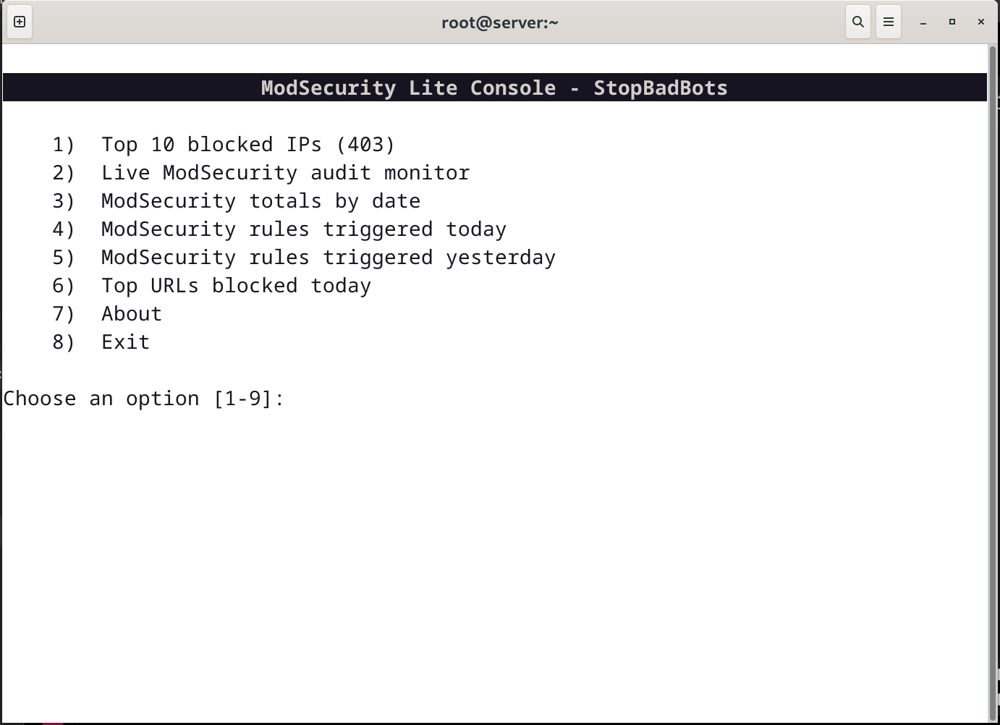

# ModSecurity Lite Console - StopBadBots

Lightweight real-time ModSecurity monitoring console for Linux servers.

Designed for Apache, CWAF and StopBadBots environments, MSLC provides fast terminal-based inspection of ModSecurity activity without external Python dependencies or heavy frameworks.

The project focuses on operational simplicity, low resource usage and quick incident visibility directly from production servers.

---

## Features

- Real-time ModSecurity audit monitoring
- Top blocked IP detection
- Daily attack summaries
- Top blocked URLs
- Lightweight terminal interface
- No external Python dependencies
- Optimized for Linux servers
- Designed for Apache/CWAF environments
- Compatible with custom ModSecurity rule sets
- Built to work together with StopBadBots and additional Comodo WAF rules

---

## Screenshot



---

## Files

```text
bin/mslc-console.sh             Main terminal menu
bin/mslc-live-monitor.py        Real-time formatted ModSecurity audit monitor
bin/mslc-rules-today.py         ModSecurity rules triggered today
bin/mslc-rules-yesterday.py     ModSecurity rules triggered yesterday
bin/mslc-rule-totals.py         Daily totals from ModSecurity audit logs
bin/mslc-top-urls-today.py      Top blocked URLs for today

conf/mslc.conf                  Default configuration reference

install.sh                      Installer
uninstall.sh                    Uninstaller
```

---

## Install

```bash
sudo ./install.sh
```

Then run:

```bash
mslc
```

---

## Configuration

The only required adjustment is the ModSecurity audit log path.

Default path used by MSLC:

```text
/usr/local/apache/logs/modsec_audit.log

---

## Requirements

- Bash
- Python 3
- Standard Linux tools:
  - `awk`
  - `grep`
  - `tail`
  - `sort`
  - `uniq`
  - `head`
  - `watch`

Default environment:

- Apache
- ModSecurity
- CWAF / Comodo WAF
- Linux server

---

## Default Log Paths

```text
/usr/local/apache/logs/access_log
/usr/local/apache/logs/modsec_audit.log
```

---

## Menu

```text
1) Top 10 blocked IPs (403)
2) Live ModSecurity audit monitor
3) ModSecurity totals by date
4) ModSecurity rules triggered today
5) ModSecurity rules triggered yesterday
6) Top URLs blocked today
7) About
8) Exit
```

---

## Compatible Rule Sets

MSLC was designed to work with:

- Comodo WAF / CWAF
- StopBadBots rules
- Custom ModSecurity rules
- Additional defensive ModSecurity configurations

The console parses and formats audit log events generated by these environments.

---

## Philosophy

MSLC focuses on operational simplicity.

It is intentionally lightweight and terminal-oriented, designed for fast incident inspection directly on production Linux servers.

This is not intended to replace a SIEM platform. The goal is quick visibility, rapid investigation and low-overhead monitoring.

---

## Tested Environments

- CentOS
- AlmaLinux
- Rocky Linux
- CWP (CentOS Web Panel)
- Apache + ModSecurity
- CWAF

---

## Disclaimer

This tool is intended for defensive system administration and security log analysis only.

---

## License

GPL v3

Copyright (c) 2026 Bill Minozzi
